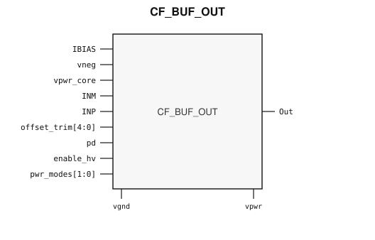

# CF_BUF_OUT

> Analog output buffer

The public GDS is an abstract; ChipFoundry
substitutes protected full geometry at tapeout.

This package ships an SRAM-style PG wrap `CF_BUF_OUT` around analog leaf
`CF_BUF_OUT_core`.

## Overview

`CF_BUF_OUT` is a SkyWater 130 nm hard-macro analog output buffer. Instantiate `CF_BUF_OUT`.

Macro size is 296.69 × 311.91 µm (15 µm halo around analog leaf 266.69 × 281.91 µm).
Customer PG for chip PDN is `vpwr` / `vgnd`. Analog ports `vneg` and `vpwr_core`
stay wrap ports and are routed as signals.

## Installation

```bash
pip install cf-ipm
ipm install CF_BUF_OUT --version 0.2.0
```

Use `hdl/gl/CF_BUF_OUT.v` as the customer blackbox, `layout/lef/CF_BUF_OUT.lef`
for P&R, and `layout/gds/CF_BUF_OUT.gds` / `layout/mag/CF_BUF_OUT.mag` for the
public wrap. `CF_BUF_OUT_core` is the analog leaf (empty Verilog, pin-only
abstract). ChipFoundry substitutes vault GDS into `CF_BUF_OUT_core` at tapeout.
P&R uses the wrap LEF (`vpwr` / `vgnd` for chip PDN).

Functional sim compiles `verify/beh_model/CF_BUF_OUT_core.v` **instead of** the empty `hdl/gl/CF_BUF_OUT_core.v` stub. See `verify/beh_model/README.md`.

## Features

- Differential inputs `INP` and `INM`
- Output `Out`
- Power-down `pd` and high-voltage enable `enable_hv`
- Offset trim `offset_trim[4:0]` and power modes `pwr_modes[1:0]`
- Bias `IBIAS`
- Analog ports `vneg` and `vpwr_core`
- Ideal Verilog behavioral model under `verify/beh_model/` for functional sim
- Customer cell `CF_BUF_OUT` 296.69 × 311.91 µm (15 µm halo around analog leaf 266.69 × 281.91 µm)
- Chip PDN is `vpwr` / `vgnd`

## Pinout

Customer documentation includes a pinout of the integration cell only.
Internal schematics and architecture block diagrams are not published.



Pin names and directions match the public wrap (`layout/lef/CF_BUF_OUT.lef`)
and the blackbox stub (`hdl/gl/CF_BUF_OUT.v`).

## Pin Description

Directions and widths are taken from the shipped Verilog in `hdl/gl/CF_BUF_OUT.v`.

| Name | Direction | Width | Description |
|---|---|---:|---|
| `Out` | output | 1 | Buffer output. Follows `INP` in the ideal model when enabled. |
| `IBIAS` | input | 1 | Bias. Route as a signal; not on chip PDN. |
| `vneg` | input | 1 | Negative analog rail. Route as a signal; not on chip PDN. |
| `vpwr_core` | inout | 1 | Core analog supply. Route as a signal; not on chip PDN. |
| `vgnd` | input | 1 | Ground. |
| `vpwr` | input | 1 | Digital supply. |
| `INM` | input | 1 | Negative input. Not used by the ideal model. |
| `INP` | input | 1 | Positive input. |
| `offset_trim` | input | 5 | Offset trim. Not modeled. |
| `pd` | input | 1 | Power-down. High clears `Out` in the ideal model. |
| `enable_hv` | input | 1 | Enable. Low clears `Out` in the ideal model. |
| `pwr_modes` | input | 2 | Power-mode code. Not modeled. |

`CF_BUF_OUT_core` well taps `vpb` and `vnb` are tied inside the wrap
(`.vpb(vpwr)`, `.vnb(vgnd)`). Do not connect those pins at chip level.

In OpenLane / LibreLane, hook chip PDN with
`PDN_MACRO_CONNECTIONS: "u_cf_buf_out vccd1 vssd1 vpwr vgnd"` and connect
`.vpwr(vccd1)`, `.vgnd(vssd1)` under `USE_POWER_PINS`. Route `vneg`,
`vpwr_core`, `INP`, `INM`, `Out`, and `IBIAS` onto `analog_io`.

```json
"SYNTH_ELABORATE_ONLY": true,
"SYNTH_USE_PG_PINS_DEFINES": "USE_POWER_PINS",
"FP_PDN_ENABLE_RAILS": false,
"RUN_TAP_ENDCAP_INSERTION": false,
"FP_PDN_HORIZONTAL_HALO": 10,
"FP_PDN_VERTICAL_HALO": 10,
"PDN_MACRO_CONNECTIONS": ["u_cf_buf_out vccd1 vssd1 vpwr vgnd"],
"MAGIC_EXT_USE_GDS": false,
"MAGIC_EXT_ABSTRACT_CELLS": ["^CF_BUF_OUT_core$"],
"PRIMARY_GDSII_STREAMOUT_TOOL": "magic",
"MAGIC_MACRO_STD_CELL_SOURCE": "macro",
"MAGIC_CAPTURE_ERRORS": false,
"RUN_MAGIC_DRC": false
```

## Specifications

This macro is the catalog analog output buffer. No Liberty timing file
ships with this package. This README does not invent PVT tables. The ideal
model drives `Out` from `INP`. It does not implement unity-gain or
external-component amplifier modes.

## Timing Diagram

The ideal model in `verify/beh_model/` is the functional timing reference for
simulation. `pd` high clears `Out`. With `pd` low and `enable_hv` high, `Out`
follows `INP`. That model is not silicon-verified.

## Limitations and Open Issues

- Verilog in `hdl/gl/CF_BUF_OUT.v` is a structural wrap around an empty
  `CF_BUF_OUT_core` blackbox. Functional sim uses `verify/beh_model/CF_BUF_OUT_core.v` (ideal model, not SPICE).
- Liberty is not in this package. P&R uses the wrap LEF.
- Offset trim, power modes, bias, negative rail, and linear gain are not modeled.

## Release History

| Version | Date | Notes |
|---|---|---|
| 0.2.0 | 2026-09-28 | First SRAM-style PG-wrapped package. Ideal behavioral model. Core fill-exclude covers. |

## Tapeout History

This hard macro has high-volume commercial production history (millions of
units). Catalog and IPM maturity is Production. ChipFoundry substitutes
protected full layout at tapeout. The chipIgnite delivery of this package is
not marked shuttle-proven until a run returns.
